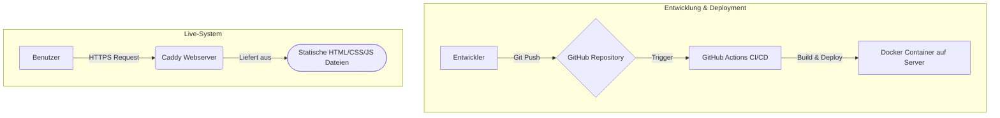

### 1. Einleitung und Motivation

Dieses Projekt ist die Konzeption und Umsetzung meines persönlichen Portfolios. Ziel war es, eine digitale Visitenkarte zu schaffen, die nicht nur meine Arbeit als Entwickler präsentiert, sondern auch meine Fähigkeiten in den Bereichen UI/UX-Design, Systemarchitektur und Content-Strategie demonstriert. Die Website dient als zentraler Anlaufpunkt für potenzielle Arbeitgeber, Kunden und die Tech-Community.

### 2. Problemstellung und Ziele

**Problem:** Als Entwickler und Designer benötige ich eine professionelle Online-Präsenz, die flexibel, performant und einfach zu pflegen ist. Eine Standard-Website von der Stange würde meinen technischen Anspruch nicht widerspiegeln.

**Ziele:**
*   **Performance:** Die Seite muss extrem schnell laden (Ziel: Google Lighthouse Score > 95 in allen Kategorien).
*   **Pflegbarkeit:** Alle Inhalte, insbesondere Projekte und Blogartikel, müssen einfach und ohne Code-Änderungen über Markdown-Dateien verwaltet werden können.
*   **Skalierbarkeit:** Die Architektur muss es ermöglichen, zukünftig weitere Features wie einen vollwertigen Blog oder interaktive Case Studies zu integrieren.
*   **CI/CD:** Jeder Push auf den `main`-Branch soll automatisch getestet und ohne Ausfallzeit auf dem Server deployed werden.

### 3. Systemarchitektur und Design

**Architekturüberblick:**
Die Anwendung wurde als "statically rendered" Nuxt-App konzipiert. Das bedeutet, dass zum Zeitpunkt des Deployments alle Seiten als statische HTML-Dateien generiert werden. Dies sorgt für maximale Performance und Sicherheit. Ein Caddy-Webserver liefert die statischen Dateien aus und kümmert sich um das SSL-Zertifikat.

**Architektur-Diagramm:**
::BaseMermaid

::

**Begründung der Technologie-Wahl:**
*   **Nuxt.js:** Gewählt wegen seiner hervorragenden Unterstützung für Static Site Generation (SSG), dem modularen Aufbau und der starken Integration in das Vue.js-Ökosystem.
*   **Docker:** Ermöglicht eine saubere, isolierte und reproduzierbare Hosting-Umgebung. Der gesamte Webserver läuft in einem einzigen Container.
*   **GitHub Actions:** Für eine professionelle Continuous Integration und Continuous Deployment Pipeline, die den Prozess von Code-Commit bis zum Livegang vollständig automatisiert.
*   **TailwindCSS:** Für ein schnelles, utility-first UI-Development, das volle Kontrolle über das Design ermöglicht.

### 4. Implementierungshighlights

**Mehrsprachigkeit (i18n):**
Die Mehrsprachigkeit wurde mit dem Modul `@nuxt/i18n` umgesetzt. In der Konfiguration (`nuxt.config.ts`) sind Deutsch (`de`) und Englisch (`en`) als verfügbare `locales` definiert, wobei Deutsch als Standardsprache festgelegt ist. Die Inhalte werden sprachspezifisch in den Verzeichnissen `content/de` und `content/en` abgelegt. Das Modul erkennt automatisch die Browser-Sprache des Benutzers und leitet ihn zur passenden Version weiter. Ein Sprachumschalter in der Navigationsleiste ermöglicht den manuellen Wechsel. Dieser nutzt die von `@nuxt/i18n` bereitgestellte `switchLocalePath`-Funktion, um nahtlos zwischen den Sprachversionen zu navigieren, ohne den Anwendungszustand zu verlieren.

**Markdown-basiertes Content-System:**
Das Herzstück der Inhaltsverwaltung ist Nuxt Content. Dieses Modul scannt die Markdown-Dateien im `content/`-Verzeichnis, parst sie und stellt sie über eine abfragbare API zur Verfügung. Jede Markdown-Datei enthält einen YAML-Frontmatter-Block am Anfang, in dem Metadaten wie `title`, `date`, `techstack` oder `image` definiert werden. In den Vue-Komponenten, beispielsweise auf der Projektübersichtsseite, wird die `queryContent()`-Funktion von Nuxt Content genutzt, um diese Daten abzurufen und zu filtern. So können beispielsweise alle Projekte dynamisch als `ProjectCard`-Komponenten gerendert werden, wobei die Daten aus dem Frontmatter direkt als `props` an die Komponente übergeben werden.

### 5. Ergebnisse und Ausblick

**Erreichte Ziele:**
Die Website ist live und erfüllt alle zu Beginn gesetzten Ziele. Die Ladezeiten sind exzellent, und der Content-Workflow über Git und Markdown ist hocheffizient. Das automatisierte Deployment sorgt für einen reibungslosen Update-Prozess.

**Mögliche nächste Schritte:**
*   **Implementierung eines vollwertigen Blogs:** Ausbau der aktuellen Projekt- und Blog-Sektion zu einem voll funktionsfähigen Blog mit Kategorien, Tags und Kommentaren.
*   **Integration eines Headless CMS:** Anbindung eines CMS wie Strapi oder Storyblok, um die Inhaltsverwaltung weiter zu vereinfachen und für nicht-technische Benutzer zu öffnen.

### 6. Persönliches Wachstum und Lessons Learned

**Modulare Komponentenentwicklung:**
Die Entwicklung der UI-Komponenten wie `UiCard` oder `UiHeading` erfolgte streng nach dem Prinzip der Wiederverwendbarkeit. Durch die konsequente Nutzung der Vue 3 Composition API konnte die Logik sauber von der Darstellung getrennt werden. Props dienten dazu, die Komponenten flexibel mit Daten zu versorgen (z.B. Titel, Text, Bild-URL). Für die Inhaltsstrukturierung, insbesondere bei komplexeren Komponenten wie der `Card`, kamen Slots zum Einsatz, um benutzerdefiniertes HTML direkt in die Komponente injizieren zu können. Dieser Ansatz hat nicht nur die Entwicklungsgeschwindigkeit erhöht, sondern auch die Wartbarkeit des gesamten Frontends erheblich verbessert, da Änderungen an einer zentralen Stelle vorgenommen werden können.

**CI/CD-Pipeline:**
Das Aufsetzen der CI/CD-Pipeline mit GitHub Actions war eine der lehrreichsten Erfahrungen. Eine zentrale Herausforderung war die Optimierung der Build-Zeiten. Durch den Einsatz von Caching für `node_modules` konnte die Dauer für die Installation der Dependencies von mehreren Minuten auf wenige Sekunden reduziert werden. Die sichere Verwaltung von Geheimnissen, wie dem SSH-Key für das Deployment auf den Server, wurde über GitHub Secrets gelöst. Dadurch wird der Key niemals im Code oder in den Logs exponiert. Die Pipeline ist so konfiguriert, dass sie bei jedem Push auf den `main`-Branch automatisch den Build-Prozess startet und die fertigen statischen Dateien via `scp` auf den Webserver überträgt, was einen nahtlosen und automatisierten Release-Prozess gewährleistet.
