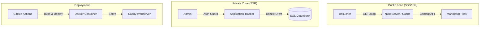

### 1. Einleitung und Motivation

Dieses Projekt ist die Konzeption und Umsetzung meines persönlichen Portfolios. Ziel war es, eine digitale Visitenkarte zu schaffen, die nicht nur meine Arbeit als Entwickler präsentiert, sondern auch meine Fähigkeiten in den Bereichen UI/UX-Design, Systemarchitektur und Fullstack-Development demonstriert. Die Website dient als zentraler Anlaufpunkt für potenzielle Arbeitgeber, Kunden und die Tech-Community. Darüber hinaus habe ich die Plattform erweitert, um meine eigenen beruflichen Prozesse – wie das Management von Bewerbungen – direkt in der Anwendung abzubilden.

### 2. Problemstellung und Ziele

**Problem:** Als Entwickler und Designer benötige ich eine professionelle Online-Präsenz, die flexibel, performant und einfach zu pflegen ist. Gleichzeitig fehlte mir ein zentrales Tool, um den Überblick über laufende Bewerbungsprozesse und Kontakte zu behalten, ohne auf externe Tabellenkalkulationen angewiesen zu sein.

**Ziele:**
*   **Performance:** Die öffentliche Seite muss extrem schnell laden (Ziel: Google Lighthouse Score > 95), was für eine statische Generierung spricht.
*   **Interaktivität:** Der interne Bereich ("Application Tracker") muss hochdynamisch sein und Datenbankzugriffe erlauben.
*   **Effizienz:** Inhalte sollen einfach über Markdown gepflegt werden, wobei Übersetzungen durch KI automatisiert werden, um Redundanz zu vermeiden.
*   **Datenhoheit:** Strukturierte Daten (Bewerbungen, Firmen) sollen in einer eigenen SQL-Datenbank verwaltet werden.
*   **CI/CD:** Jeder Push auf den `main`-Branch soll automatisch getestet und deployed werden.

### 3. Systemarchitektur und Design

**Architekturüberblick:**
Die Anwendung nutzt eine moderne Hybrid-Architektur mit Nuxt 4. Dies ermöglicht "das Beste aus beiden Welten":
*   **Public Zone:** Startseite, Blog und Projekte werden statisch generiert (SSG) oder gecached (ISR) für maximale Performance und SEO.
*   **Private Zone:** Der Admin-Bereich wird serverseitig gerendert (SSR), um dynamische Interaktionen mit der Datenbank zu ermöglichen.

**Datenbank & Backend:**
Als Datenbank kommt SQLite zum Einsatz, verwaltet über **Drizzle ORM**. Dies garantiert Typsicherheit von der Datenbank bis ins Frontend. Die Authentifizierung erfolgt über Nuxt Auth Utils.

**Architektur-Diagramm:**
::BaseMermaid

```mermaid
graph TD
    subgraph "Public Zone (SSG/ISR)"
        A[Besucher] -- GET /blog --> B(Nuxt Server / Cache)
        B -- Content API --> C[Markdown Files]
    end

    subgraph "Private Zone (SSR)"
        D[Admin] -- Auth Guard --> E[Application Tracker]
        E -- Drizzle ORM --> F[(SQL Datenbank)]
    end

    subgraph "Deployment"
        G[GitHub Actions] -- Build & Deploy --> H[Docker Container]
        H -- Serve --> I[Caddy Webserver]
    end
```
::

### 4. Implementierungshighlights

**Job Application Tracker (Intern):**
Ein vollständig integriertes Dashboard zur Verwaltung von Bewerbungsprozessen.
*   **Features:** Kanban-Ansicht für Status, Firmen- & Kontaktmanagement, Historie & Notizen.
*   **Tech:** Nutzung von Server-Komponenten und Server-Actions für direkte Datenbankoperationen ohne separaten API-Layer.

**AI-Powered i18n:**
Statt Übersetzungsdateien manuell zu pflegen, analysiert ein eigens entwickeltes Modul (`autoTranslate`) beim Build oder auf Anfrage geänderte Inhalte. Es extrahiert Textsegmente aus den Markdown-Dateien, sendet sie mit Kontext an ein LLM (wie GPT-4) und speichert die Übersetzungen strukturiert zurück. Dies ermöglicht eine echte Zweisprachigkeit mit minimalem Aufwand.

**Markdown-basiertes Content-System:**
Für den öffentlichen Teil (Blog, Projekte) kommt Nuxt Content zum Einsatz. Metadaten (Frontmatter) steuern die Darstellung, während der eigentliche Inhalt in Markdown verfasst wird. Dies hält die Inhaltspflege vom Code getrennt und übersichtlich.

### 5. Ergebnisse und Ausblick

**Erreichte Ziele:**
Die Website ist live und erfüllt die hybriden Anforderungen perfekt. Die Ladezeiten im öffentlichen Bereich sind exzellent, während der Application Tracker meinen Arbeitsalltag massiv erleichtert. Die Automatisierung der Übersetzungen spart bei jedem neuen Artikel wertvolle Zeit.

**Mögliche nächste Schritte:**
*   **Erweiterung der KI:** Automatische Zusammenfassung von Job-Beschreibungen oder Generierung von Anschreiben-Entwürfen.
*   **Public API:** Öffnung bestimmter, nicht-sensibler Datenpunkte für Dritte.

### 6. Persönliches Wachstum und Lessons Learned

**Modulare Komponentenentwicklung:**
Die Entwicklung der UI-Komponenten erfolgte streng nach dem Prinzip der Wiederverwendbarkeit. Durch die konsequente Nutzung der Vue 3 Composition API und TypeScript konnte die Logik sauber von der Darstellung getrennt werden.

**Fullstack & Datenbanken:**
Der Schritt von einer reinen Frontend/SSG-Seite hin zu einer Fullstack-Anwendung mit Datenbank (SQL/Drizzle) war ein wichtiger Lernprozess. Insbesondere das Schema-Design und die Synchronisation von Typen zwischen Backend und Frontend haben mein Verständnis für robuste Anwendungsarchitekturen vertieft.

**CI/CD-Pipeline:**
Das Aufsetzen der CI/CD-Pipeline mit GitHub Actions sorgt für professionelle Standards. Caching-Strategien für `node_modules` und Docker-Layer haben die Build-Zeiten minimiert, sodass Deployments in wenigen Minuten live sind.