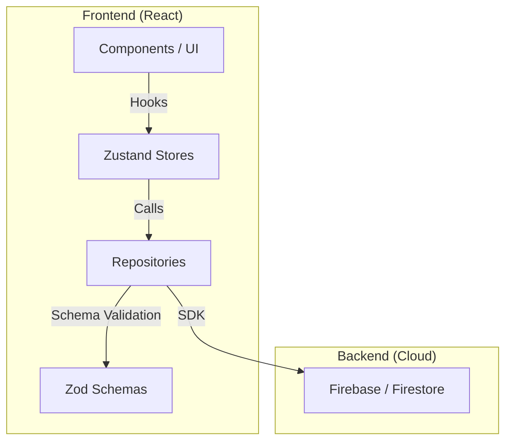

### 1. Einleitung und Motivation

Riffle entstand aus der Idee, Umfragen von einem statischen Datenerfassungstool in ein interaktives Erlebnis zu verwandeln. In einer Zeit, in der die Aufmerksamkeitsspanne sinkt, bietet Riffle durch Gamification-Elemente wie Punkte und Badges einen Anreiz zur aktiven Teilnahme. Das Projekt demonstriert die Umsetzung einer skalierbaren SaaS-Architektur mit modernen Frontend-Technologien und einem Cloud-Backend.

### 2. Problemstellung und Ziele

**Problem:** Klassische Umfrage-Tools sind oft trocken, bieten wenig Anreiz zur Teilnahme und erschweren die Organisation in Teams oder spezifischen Interessengruppen.

**Ziele:**
*   **Hohes Engagement:** Steigerung der Rücklaufquoten durch Gamification (Leaderboards, Belohnungen).
*   **Strukturierte Organisation:** Einführung von Workspaces und Gruppen für Unternehmen und Communities.
*   **Echtzeit-Feedback:** Sofortige Visualisierung der Ergebnisse ohne manuelle Aktualisierung.
*   **Clean Architecture:** Aufbau einer wartbaren Codebasis durch klare Trennung von Datenhaltung (Repositories), Zustand (Stores) und Darstellung (Components).

### 3. Systemarchitektur und Design

**Architekturüberblick:**
Die Anwendung folgt einem strengen Repository-Pattern. Dies entkoppelt die Geschäftslogik von der konkreten Implementierung der Datenquelle (Firebase).

**Komponenten der Architektur:**
*   **Frontend:** React mit TypeScript für maximale Typsicherheit.
*   **Backend-as-a-Service:** Firebase (Authentication, Firestore, Hosting) für schnelle Iterationszyklen und Echtzeit-Fähigkeiten.
*   **State Management:** Zustand mit mehreren spezialisierten Stores (`authStore`, `pollStore`, `workspaceStore`), um Seiteneffekte zu minimieren und die Performance zu optimieren.
*   **Validation:** Zod stellt sicher, dass alle Daten, die das Repository verlassen oder betreten, dem erwarteten Schema entsprechen.

**Architektur-Diagramm:**
::BaseMermaid

::

### 4. Implementierungshighlights

**Gamification-Engine:**
Das Leaderboard berechnet Ränge basierend auf Nutzeraktivitäten (Teilnahme an Umfragen, Erstellung von Content). Ein Badge-System belohnt spezifische Meilensteine. Die Logik ist so konzipiert, dass sie durch Cloud Functions oder direkt im Client (bei kleineren Gruppen) effizient verarbeitet werden kann.

**Flexibles Workspace-Management:**
Nutzer können eigene Arbeitsbereiche erstellen und Mitglieder via E-Mail einladen. Ein integriertes Einladungssystem mit Statusverfolgung (`pending`, `accepted`) sorgt für eine saubere Nutzerverwaltung innerhalb der hierarchischen Strukturen von Workspaces und Gruppen.

### 5. Ergebnisse und Ausblick

**Aktueller Stand:**
Der Proof-of-Concept ist voll funktionsfähig und bietet alle Kernfeatures von der Authentifizierung bis hin zu komplexen Analytics-Dashboards. Die gewählte Architektur erlaubt eine einfache Erweiterbarkeit um neue Datenquellen oder zusätzliche Gamification-Mechaniken.

**Nächste Schritte:**
*   **Cloud Functions:** Auslagerung rechenintensiver Gamification-Logik auf den Server.
*   **Template-System:** Vordefinierte Umfrage-Templates für verschiedene Anwendungsfälle.
*   **Export-Funktion:** PDF- und CSV-Export für detaillierte Berichte.

### 6. Persönliches Wachstum und Lessons Learned

**Clean Architecture im Frontend:**
Die konsequente Anwendung des Repository-Patterns hat gezeigt, wie wertvoll Abstraktion ist. Der Wechsel von Mock-Daten zu echtem Firebase war durch die klaren Schnittstellen innerhalb weniger Stunden erledigt.

**Enterprise Frontend Patterns:**
Durch die Arbeit mit Zod und komplexen Stores habe ich tiefe Einblicke in Enterprise-grade Frontend-Entwicklung gewonnen. Die Herausforderung, eine komplexe Applikationslogik typsicher und performant abzubilden, war eine der lehrreichsten Erfahrungen dieses Projekts.