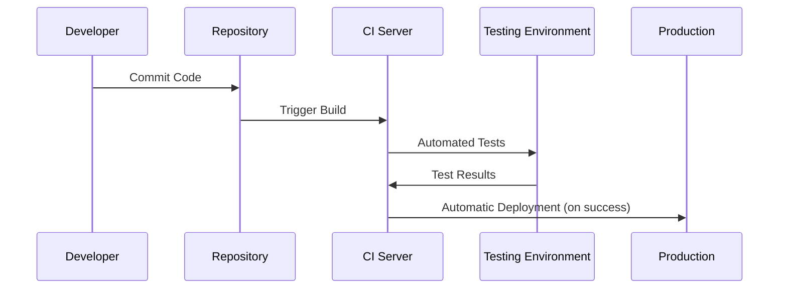
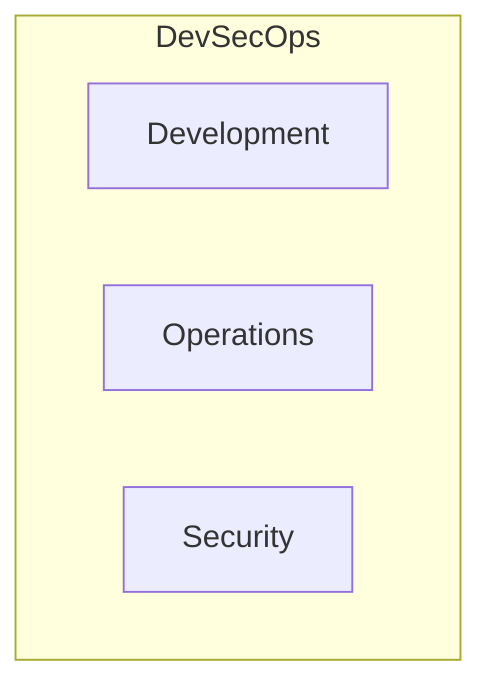

## What is DevOps?  
DevOps is a combination of software development (Development) and IT operations (Operations) – a portmanteau that unites these two traditionally separate areas. It is not just a technology or a tool, but a culture, a philosophy, and a collection of methods aimed at improving collaboration between development and operations teams.

The term "DevOps" emerged between 2007 and 2008 when software developers and IT experts became aware of the problematic separation between those who write the code and those who deploy and support it. Belgian system administrator Patrick Debois recognized that better collaboration between development and operations could lead to faster and less error-prone software delivery. During the Velocity Conference in June 2009 in San José, the term "DevOps" was coined, and in October 2009, Patrick Debois organized the first DevOpsDays conference in Ghent.

## The Core Principles of DevOps  
DevOps is based on five core principles that together bring about a cultural shift within organizations:

1. **Culture** – A framework for collaboration and communication between teams  
2. **Continuous Improvement** – Ongoing enhancement of workflows and processes  
3. **Sharing** – Sharing information and knowledge across departmental boundaries  
4. **Automation** – Automating to increase efficiency and quality  
5. **Measurement** – Collecting and analyzing relevant metrics for process optimization  

These principles aim to break down silos between departments and create an environment where teams can operate collaboratively and agilely.

## The DevOps Lifecycle  
The DevOps lifecycle is a continuous process consisting of several phases. Depending on the source, seven or eight phases are distinguished. These phases flow seamlessly into each other, forming a closed loop:

This cycle enables continuous improvement of the software by incorporating feedback from operations directly into planning new features.

## Continuous Integration and Continuous Delivery/Deployment (CI/CD)  
A central element of DevOps is the implementation of CI/CD pipelines that automate the software development and deployment process:

### Continuous Integration (CI)  
In Continuous Integration, code changes are regularly integrated into a central repository, with automated builds and tests performed. This helps identify and fix integration issues early, rather than confronting them only at the end of a development cycle.

### Continuous Delivery (CD)  
Continuous Delivery extends CI by automating the entire software deployment process. After successful tests, the software can be deployed to production at any time with a single click.

### Continuous Deployment  
Continuous Deployment goes a step further: every change that passes all tests successfully is automatically deployed to the production environment—without human intervention. This significantly accelerates the feedback cycle with customers.

## Why is DevOps Important?  
DevOps offers numerous benefits for organizations and teams developing and operating modern software:

### Faster Time-to-Market  
Automation and improved collaboration enable new software and updates to be released more quickly and reliably. This allows companies to respond faster to customer needs and market changes, remaining competitive in an increasingly fast-paced business environment.

### Higher Software Quality  
The combination of automated tests, continuous integration, and continuous delivery significantly improves software quality. Errors are detected earlier and can be fixed faster, leading to more stable applications.

### Improved Collaboration  
DevOps fosters a culture of collaboration between development and operations through simplified communication and a better understanding of each other's requirements. This results in more efficient workflows and fewer friction points between teams.

### Stronger Customer Focus  
Through continuous feedback loops, customer needs can be identified and integrated into software development more rapidly. This leads to products better aligned with actual user requirements.

### Greater Flexibility and Agility  
DevOps teams can respond more quickly to changes, continuously develop and improve software using agile practices. This increases the organization’s adaptability to changing market conditions.

## DevOps vs. Traditional Development  
Compared to traditional software development, DevOps offers clear advantages:

### Collaboration Instead of Silos  
In traditional development, development and operations teams work separately, leading to communication problems and delays. DevOps promotes close collaboration and integration of these teams, breaking down silos.

### Agility Instead of Waterfall  
Traditional development often uses waterfall methods, where each phase must be completed before the next begins. DevOps relies on agile methods, enabling faster iterations and continuous improvements.

### Automation Instead of Manual Processes  
While traditional development involves many manual processes, DevOps emphasizes automation, especially in testing and deployment. This reduces human errors and speeds up the entire development cycle.

## DevOps Tools and Technologies  
Numerous tools support the implementation of DevOps across different phases of the lifecycle:

### Version Control and Collaboration  
- Git for version control  
- GitHub or GitLab for collaborative work

### CI/CD Tools  
- Jenkins for automation  
- Azure DevOps for comprehensive DevOps functionality  
- AWS CodePipeline for CI/CD in AWS environments

### Containerization  
- Docker for containerizing applications  
- Kubernetes for container orchestration

### Infrastructure as Code  
- Terraform for cross-platform infrastructure  
- AWS CloudFormation for AWS resources  
- Azure Resource Manager (ARM) for Azure resources

The choice of tools depends on the specific requirements of the team and project.

## DevOps Careers and Salary  
The demand for DevOps professionals has risen sharply in recent years. In 2024, DevOps engineering was one of the five most sought-after jobs worldwide, and this trend is expected to continue.

### Salary Perspectives in the US and Europe  
As a DevOps engineer, attractive salaries are common:  
- The average annual gross salary is approximately $70,000 to $80,000 USD (varies by country)  
- Entry-level positions with less than three years of experience typically start around $55,000 to $65,000 USD  
- With 10+ years of experience, salaries can exceed $100,000 USD  
- In major cities like San Francisco, Berlin, or London, salaries tend to be higher

### Qualifications and Continuing Education  
To work as a DevOps engineer, the following qualifications are helpful:  
- Knowledge of software development and IT administration  
- Experience with cloud platforms like AWS or Azure  
- Understanding of automation tools and CI/CD pipelines

Various certifications can enhance career prospects, such as AWS DevOps Engineer, Azure DevOps Engineer, or specialized DevOps training like DevOps Foundation or DevOps Master.

## Future Trends in DevOps for 2025  
DevOps is constantly evolving. The following trends are expected for 2025:

### AI-Driven Automation  
Artificial intelligence will increasingly be integrated into DevOps processes to create autonomous pipelines that not only analyze data but also make real-time decisions. This will lead to self-healing systems that detect and resolve issues before they become critical.

### DevSecOps Becomes Standard  

Security integration into the DevOps process (DevSecOps) will no longer be optional but essential by 2025. Security considerations will be embedded from the start of development rather than added later.

### Multi-Cloud and GitOps 2.0  
Managing infrastructure across multiple cloud platforms will become increasingly important. GitOps will evolve into an event-driven, self-correcting approach enhanced with AI, maintaining application health without manual oversight.

## Conclusion  
DevOps is much more than a technical approach – it is a culture and philosophy that fundamentally changes how software is developed and operated. By bridging the traditional gap between development and operations, DevOps enables faster, more reliable, and higher-quality software deployments.

In an era where digital transformation and rapid time-to-market are key competitive advantages, DevOps is becoming increasingly vital for organizations. Continuous integration, delivery, and improvement of software allow companies to be more agile and better meet customer needs.

For newcomers to the IT world, DevOps offers exciting career prospects with attractive salaries and diverse development opportunities. With a solid understanding of DevOps principles and practices, professionals can contribute significantly to the digital transformation of organizations while securing their own professional future.