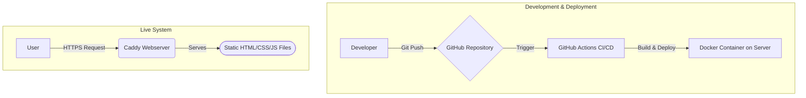

### 1. Introduction and Motivation

This project is the conception and implementation of my personal portfolio. The goal was to create a digital business card that not only presents my work as a developer but also demonstrates my abilities in UI/UX design, system architecture, and content strategy. The website serves as a central hub for potential employers, clients, and the tech community.

### 2. Problem Statement and Goals

**Problem:** As a developer and designer, I need a professional online presence that is flexible, performant, and easy to maintain. A standard off-the-shelf website wouldn't reflect my technical standards.

**Goals:**
*   **Performance:** The page must load extremely fast (target: Google Lighthouse Score > 95 in all categories).
*   **Maintainability:** All content, especially projects and blog articles, must be easily managed via Markdown files without code changes.
*   **Scalability:** The architecture must allow for future integration of additional features like a full blog or interactive case studies.
*   **CI/CD:** Every push to the `main` branch should automatically be tested and deployed to the server without downtime.

### 3. System Architecture and Design

**Architecture Overview:**
The application was designed as a "statically rendered" Nuxt app. This means that at deployment time, all pages are generated as static HTML files. This ensures maximum performance and security. A Caddy web server serves the static files and handles the SSL certificate.

**Architecture Diagram:**
::BaseMermaid

::

**Technology Choice Rationale:**
*   **Nuxt.js:** Chosen for its excellent support for Static Site Generation (SSG), modular structure, and strong integration into the Vue.js ecosystem.
*   **Docker:** Enables a clean, isolated, and reproducible hosting environment. The entire web server runs in a single container.
*   **GitHub Actions:** For professional Continuous Integration and Continuous Deployment pipeline that fully automates the process from code commit to going live.
*   **TailwindCSS:** For fast, utility-first UI development that provides full control over the design.

### 4. Implementation Highlights

**Multilingual Support (i18n):**
Multilingual support was implemented with the `@nuxt/i18n` module. In the configuration (`nuxt.config.ts`), German (`de`) and English (`en`) are defined as available `locales`, with German set as the default language. Content is stored language-specifically in the `content/de` and `content/en` directories. The module automatically detects the user's browser language and redirects them to the appropriate version. A language switcher in the navigation bar enables manual switching. This uses the `switchLocalePath` function provided by `@nuxt/i18n` to seamlessly navigate between language versions without losing application state.

**Markdown-based Content System:**
The heart of content management is Nuxt Content. This module scans the Markdown files in the `content/` directory, parses them, and makes them available via a queryable API. Each Markdown file contains a YAML frontmatter block at the beginning where metadata like `title`, `date`, `techstack`, or `image` is defined. In the Vue components, for example on the project overview page, the `queryContent()` function from Nuxt Content is used to fetch and filter this data. This allows all projects to be dynamically rendered as `ProjectCard` components, with the data from the frontmatter being directly passed to the component as `props`.

### 5. Results and Outlook

**Achieved Goals:**
The website is live and meets all goals set at the beginning. Loading times are excellent, and the content workflow via Git and Markdown is highly efficient. Automated deployment ensures a smooth update process.

**Possible Next Steps:**
*   **Implementation of a full blog:** Expanding the current project and blog section into a fully functional blog with categories, tags, and comments.
*   **Integration of a headless CMS:** Connecting a CMS like Strapi or Storyblok to further simplify content management and make it accessible to non-technical users.

### 6. Personal Growth and Lessons Learned

**Modular Component Development:**
The development of UI components like `UiCard` or `UiHeading` followed the principle of reusability strictly. Through consistent use of the Vue 3 Composition API, logic could be cleanly separated from presentation. Props were used to flexibly supply components with data (e.g., title, text, image URL). For content structuring, especially with more complex components like the `Card`, slots were used to inject custom HTML directly into the component. This approach not only increased development speed but also significantly improved the maintainability of the entire frontend, as changes can be made at a central location.

**CI/CD Pipeline:**
Setting up the CI/CD pipeline with GitHub Actions was one of the most educational experiences. A central challenge was optimizing build times. By using caching for `node_modules`, the duration for dependency installation could be reduced from several minutes to just a few seconds. Secure management of secrets, such as the SSH key for deployment to the server, was solved via GitHub Secrets. This ensures the key is never exposed in code or logs. The pipeline is configured to automatically start the build process on every push to the `main` branch and transfer the finished static files to the web server via `scp`, ensuring a seamless and automated release process.