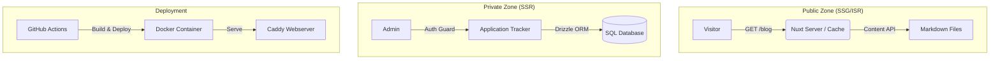

### 1. Introduction and Motivation

This project is the conception and implementation of my personal portfolio. The goal was to create a digital business card that not only presents my work as a developer but also demonstrates my skills in UI/UX design, system architecture, and fullstack development. The website serves as a central point of contact for potential employers, clients, and the tech community. Furthermore, I extended the platform to directly map my own professional processes—such as managing job applications—within the application.

### 2. Problem Statement and Goals

**Problem:** As a developer and designer, I need a professional online presence that is flexible, performant, and easy to maintain. At the same time, I lacked a central tool to keep track of ongoing application processes and contacts without relying on external spreadsheets.

**Goals:**
*   **Performance:** The public site must load extremely fast (Goal: Google Lighthouse Score > 95), which favors static generation.
*   **Interactivity:** The internal area ("Application Tracker") must be highly dynamic and allow database access.
*   **Efficiency:** Content should be easily maintained via Markdown, with translations automated by AI to avoid redundancy.
*   **Data Sovereignty:** Structured data (applications, companies) should be managed in a dedicated SQL database.
*   **CI/CD:** Every push to the `main` branch should be automatically tested and deployed.

### 3. System Architecture and Design

**Architecture Overview:**
The application uses a modern hybrid architecture with Nuxt 4. This enables "the best of both worlds":
*   **Public Zone:** Homepage, blog, and projects are statically generated (SSG) or cached (ISR) for maximum performance and SEO.
*   **Private Zone:** The admin area is server-side rendered (SSR) to enable dynamic interactions with the database.

**Database & Backend:**
SQLite is used as the database, managed via **Drizzle ORM**. This guarantees type safety from the database to the frontend. Authentication is handled by Nuxt Auth Utils.

**Architecture Diagram:**
::BaseMermaid

```mermaid
graph TD
    subgraph "Public Zone (SSG/ISR)"
        A[Visitor] -- GET /blog --> B(Nuxt Server / Cache)
        B -- Content API --> C[Markdown Files]
    end

    subgraph "Private Zone (SSR)"
        D[Admin] -- Auth Guard --> E[Application Tracker]
        E -- Drizzle ORM --> F[(SQL Database)]
    end

    subgraph "Deployment"
        G[GitHub Actions] -- Build & Deploy --> H[Docker Container]
        H -- Serve --> I[Caddy Webserver]
    end
```
::

### 4. Implementation Highlights

**Job Application Tracker (Internal):**
A fully integrated dashboard for managing application processes.
*   **Features:** Kanban view for status, company & contact management, history & notes.
*   **Tech:** Use of server components and server actions for direct database operations without a separate API layer.

**AI-Powered i18n:**
Instead of manually maintaining translation files, a custom-developed module (`autoTranslate`) analyzes changed content during build or on request. It extracts text segments from Markdown files, sends them with context to an LLM (like GPT-4), and stores the translations back in a structured manner. This enables true bilingualism with minimal effort.

**Markdown-based Content System:**
For the public part (blog, projects), Nuxt Content is used. Metadata (Frontmatter) controls the presentation, while the actual content is written in Markdown. This keeps content maintenance separate from the code and organized.

### 5. Results and Outlook

**Achieved Goals:**
The website is live and perfectly fulfills the hybrid requirements. Loading times in the public area are excellent, while the Application Tracker significantly simplifies my daily workflow. The automation of translations saves valuable time with every new article.

**Possible Next Steps:**
*   **AI Expansion:** Automatic summarization of job descriptions or generation of cover letter drafts.
*   **Public API:** Opening certain non-sensitive data points for third parties.

### 6. Personal Growth and Lessons Learned

**Modular Component Development:**
The UI components were developed strictly following the principle of reusability. Through the consistent use of the Vue 3 Composition API and TypeScript, logic could be cleanly separated from presentation.

**Fullstack & Databases:**
The step from a pure frontend/SSG site to a fullstack application with a database (SQL/Drizzle) was an important learning process. In particular, schema design and the synchronization of types between backend and frontend deepened my understanding of robust application architectures.

**CI/CD Pipeline:**
Setting up the CI/CD pipeline with GitHub Actions ensures professional standards. Caching strategies for `node_modules` and Docker layers minimized build times, so deployments go live within minutes.