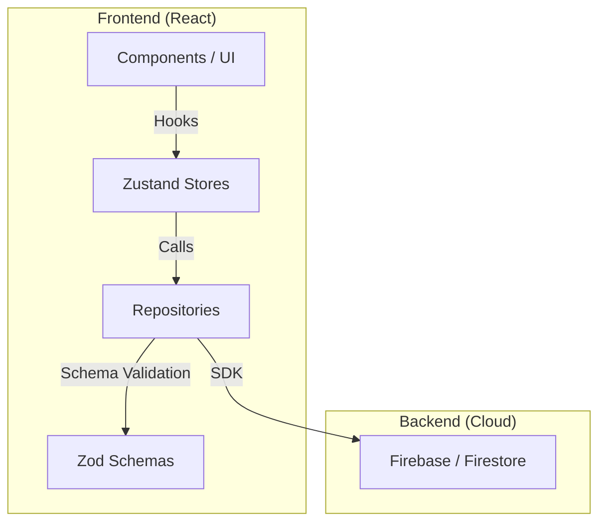

### 1. Introduction and Motivation

Riffle originated from the idea of transforming polls from a static data collection tool into an interactive experience. In a time of decreasing attention spans, Riffle provides an incentive for active participation through gamification elements like points and badges. The project demonstrates the implementation of a scalable SaaS architecture using modern frontend technologies and a cloud backend.

### 2. Problem Statement and Goals

**Problem:** Classic polling tools are often dry, offer little incentive to participate, and make organization within teams or specific interest groups difficult.

**Goals:**
*   **High Engagement:** Increase response rates through gamification (leaderboards, rewards).
*   **Structured Organization:** Introduction of workspaces and groups for companies and communities.
*   **Real-time Feedback:** Immediate visualization of results without manual refresh.
*   **Clean Architecture:** Building a maintainable codebase through clear separation of data persistence (Repositories), state (Stores), and presentation (Components).

### 3. System Architecture and Design

**Architecture Overview:**
The application follows a strict Repository Pattern. This decouples the business logic from the concrete implementation of the data source (Firebase).

**Architecture Components:**
*   **Frontend:** React with TypeScript for maximum type safety.
*   **Backend-as-a-Service:** Firebase (Authentication, Firestore, Hosting) for fast iteration cycles and real-time capabilities.
*   **State Management:** Zustand with multiple specialized stores (`authStore`, `pollStore`, `workspaceStore`) to minimize side effects and optimize performance.
*   **Validation:** Zod ensures all data entering or leaving the repository conforms to the expected schema.

**Architecture Diagram:**
::BaseMermaid

::

### 4. Implementation Highlights

**Gamification Engine:**
The leaderboard calculates ranks based on user activities (poll participation, content creation). A badge system rewards specific milestones. The logic is designed to be processed efficiently by Cloud Functions or directly in the client (for smaller groups).

**Flexible Workspace Management:**
Users can create their own workspaces and invite members via email. An integrated invitation system with status tracking (`pending`, `accepted`) ensures clean user management within the hierarchical structures of workspaces and groups.

### 5. Results and Outlook

**Current Status:**
The proof-of-concept is fully functional and offers all core features from authentication to complex analytics dashboards. The chosen architecture allows for easy extensibility with new data sources or additional gamification mechanics.

**Next Steps:**
*   **Cloud Functions:** Offloading compute-intensive gamification logic to the server.
*   **Template System:** Predefined poll templates for various use cases.
*   **Export Function:** PDF and CSV export for detailed reports.

### 6. Personal Growth and Lessons Learned

**Clean Architecture in the Frontend:**
The consistent application of the Repository Pattern demonstrated the value of abstraction. Switching from mock data to real Firebase was accomplished within a few hours thanks to the clear interfaces.

**Enterprise Frontend Patterns:**
Working with Zod and complex stores provided deep insights into enterprise-grade frontend development. The challenge of mapping complex application logic in a type-safe and performant manner was one of the most instructive experiences of this project.